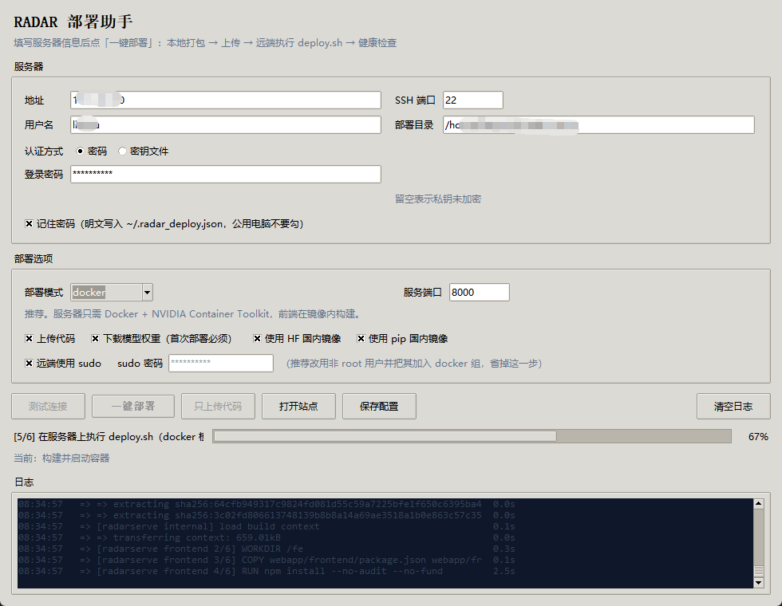

# RADAR 部署总指南

本文件是**部署入口**。先按场景选路径，再进入对应详细文档。

---

## 0. 先确认你要做什么

| 场景 | 路径 | 主文档 |
| --- | --- | --- |
| 科室/医院要用起来：HTTP 服务、多人上传、浏览器看片与结果 | **A. 服务化部署** | 本文 §1–§5 + [`OPS.md`](OPS.md) |
| 只验证权重能否跑通、复现官方 demo 的 CSV 结果 | B. 官方推理 demo | [`../../DAMO-RADAR/docs/INFERENCE.md`](../../DAMO-RADAR/docs/INFERENCE.md) |
| 在自有数据上训练 / 微调 | C. 训练 | [`../../DAMO-RADAR/docs/TRAINING.md`](../../DAMO-RADAR/docs/TRAINING.md) |
| 处理自有影像与报告的预处理流程 | — | [`../../DAMO-RADAR/docs/PREPROCESS.md`](../../DAMO-RADAR/docs/PREPROCESS.md) |

**绝大多数的部署需求走路径 A。** 路径 B 常用来在装服务之前先确认权重和环境没问题。

---

## 1. 环境准备

### 1.1 硬件

| 项 | 要求 | 说明 |
| --- | --- | --- |
| GPU | **显存 ≥ 16 GB 建议** | 峰值约 8–12 GB（按张量尺寸推算，非实测）。12 GB 勉强，8 GB 大概率 OOM |
| GPU 型号 | A10 / A100 / H20 均可，消费级 3090 / 4090 也够 | 项目 README 推荐 A100/H20，那是吞吐考虑 |
| 磁盘 | `日病例数 × 平均体积 × 保留天数` | 单例原始 DICOM 可达 2 GB |
| 内存 | ≥ 32 GB | 体数据缓存 + 前端构建 |

**显存不足没有软件解法**——降 ROI 或改精度都会影响结果正确性。只能换卡。

### 1.2 软件

| 组件 | 版本 | 说明 |
| --- | --- | --- |
| NVIDIA 驱动 | 支持 CUDA 12.1 | 驱动过旧需把 torch 换成 `cu118` |
| NVIDIA Container Toolkit | 最新 | 仅 Docker 方式需要 |
| Python | **3.10+** | 代码用了 PEP 604 的 `X \| Y` 注解 |
| Node.js | 18+ | 构建前端 |
| Docker | 20.10+ / compose v2 | 仅 Docker 方式需要 |

### 1.3 选哪种部署方式

| 方式 | 宿主机要求 | 适用 |
| --- | --- | --- |
| **Docker** | 只要 Docker + Toolkit | 生产推荐，环境隔离好 |
| **裸机 conda/venv** | 自备 CUDA 环境 | 已有 GPU 机器、不想用容器 |
| **Windows 单机** | 自备 Python + Node | 单机自用、开发调试 |
| **macOS 单机** | 自备 Python + Node | 界面联调、流程验证（**仅 CPU**，见 §3.1） |

---

## 2. 获取代码与权重

### 2.1 代码

```bash
git clone https://github.com/alibaba-damo-academy/damo-radar.git
cd damo-radar
```

### 2.2 模型权重（必做）

服务需要**三个**文件，缺任何一个都起不来（`config.ensure_ckpt_ready()` 会检查）：

| 文件 | 内容 | 来源 |
| --- | --- | --- |
| `ckpt/checkpoint_radar_pretrain.pth` | 主权重 | HuggingFace 下载 |
| `ckpt/bert-base-chinese/` | 中文 BERT，**整个目录**（config + 权重 + 词表） | HuggingFace 下载 |
| `ckpt/infer_text_embedding_radar.pt` | 文本侧预编码向量（约 0.33 MB） | **随本仓库分发** |

⚠️ **最后那个文本 embedding 不在 HuggingFace 仓库里**（核对过 `radar-generalist/RADAR` 的全部 20 个文件，没有它）。它是随项目仓库一起提供的模型资产，见根目录 `README.md` 的「模型资产」说明。所以**自动下载救不了它**——一旦缺失，多半是仓库内容不完整（`git clone` 没拉全，或打包时漏掉了 `DAMO-RADAR/ckpt/`）。`deploy.sh` 会把这类文件单独识别出来并说明，不会误导你去下载。

```bash
pip install "huggingface_hub<0.23"
cd download_scripts
python download_checkpoints.py            # 默认 --local-dir ../ckpt
```

⚠️ 两个必踩的坑：

1. `download_checkpoints.py` 里的 `local_dir_use_symlinks=False` 在 `huggingface_hub>=0.23` 已废弃、1.0 已移除，装最新版会 `TypeError`。要么固定 `<0.23`，要么删掉该参数。
2. `--local-dir ../ckpt` 是**相对当前工作目录**的，必须在 `download_scripts/` 里执行，否则会写到项目外面。

**更省事的方式**：用 §3 的一键脚本，它只拉这 3 个必需文件（不拉 `checkpoint_radar_plus.pth` 等），且绕开了上面的参数问题。

```bash
bash webapp/deploy/deploy.sh docker --download-ckpt
```

### 2.3 校验

```bash
ls ckpt/checkpoint_radar_pretrain.pth ckpt/infer_text_embedding_radar.pt ckpt/bert-base-chinese/
```

---

## 3. 部署

### 3.1 一键脚本（推荐）

```bash
bash webapp/deploy/deploy.sh                          # Docker 模式
bash webapp/deploy/deploy.sh native                   # 裸机模式
bash webapp/deploy/deploy.sh macos                    # macOS 本机（仅 CPU）
bash webapp/deploy/deploy.sh docker --download-ckpt   # 顺带下权重
```

脚本依次执行：**权重校验 → 环境检查 → 启动 → 健康检查轮询 → 打印访问信息**。

| 模式 | 前端构建 | 依赖安装 |
| --- | --- | --- |
| `docker` | 镜像内多阶段构建 | 镜像内 |
| `native` | 宿主机 `npm run build` | 项目根 `.venv` |
| `macos` | 宿主机 `npm run build` | 项目根 `.venv`（CPU 版 torch） |

Windows 单机用 PowerShell 版：

```powershell
powershell -ExecutionPolicy Bypass -File webapp\deploy\deploy.ps1
```

macOS 用 `macos` 模式：

```bash
bash webapp/deploy/deploy.sh macos --download-ckpt
```

macOS 没有 NVIDIA GPU，CUDA 轮子也没有 macOS 发行版，脚本对此做了三处适配：

- `docker` 模式在 macOS 上会被**自动改判为 `macos`**（容器无 GPU 直通，基础镜像只有 amd64、需 Rosetta 模拟，直接跑会卡在 `could not select device driver "nvidia"`）；
- torch 走 PyPI 官方 CPU 轮子，不指定 `cu121` 源（否则报 `No matching distribution found`）；
- `RADAR_DEVICE` 默认设为 `cpu`，健康检查里不会再显示误导性的 cuda。

⚠️ **macOS 只能用于功能验证与界面联调**。RADAR 是 3D 滑窗推理（`ROI=(96,256,384)` + 最多 18 次补推），CPU 上单例耗时可达数十分钟。真实分析请部署到 Linux GPU 服务器。

### 3.2 图形化部署助手（本机 → 服务器）

不想记命令行的话用 `webapp/deploy/deploy_gui.py`：一个 Tkinter 桌面程序，填完服务器信息点一下，它自动完成**本地打包 → SFTP 上传 → 远端执行 `deploy.sh` → 健康检查**。



界面上方填服务器信息（地址 / SSH 端口 / 用户名 / 认证方式 / 部署目录），中间选部署选项（部署模式、服务端口、是否上传代码、是否下载权重、HF 与 pip 镜像开关、是否 sudo），下方是实时日志、阶段进度与运行时长。建议先点「测试连接」——它只做握手与环境探测（系统、Docker、GPU、磁盘余量、是否已部署过），**不改动服务器上任何文件**。

Windows 直接双击 `webapp/deploy/deploy_gui.bat`；其它平台：

```bash
python webapp/deploy/deploy_gui.py
```

首次运行需要 `paramiko`（SSH/SFTP）。程序检测到缺失时会在顶部给出「安装依赖」按钮，也可以自己装：

```bash
pip install paramiko
```

适用场景：本机（Windows / macOS）写代码，推到远端 Linux GPU 服务器。服务器**不需要**装 git、也不需要能访问 GitHub。

它做的事：

| 步骤 | 说明 |
| --- | --- |
| 打包 | 只打源码，压缩后约 2 MB；排除 `node_modules`、`runtime`、`DAMO-RADAR/data`、`ckpt`、`.git`、`.venv` |
| 上传 | SFTP 传到部署目录，带进度条 |
| 部署 | 远端执行 `bash webapp/deploy/deploy.sh <模式>`，输出实时回显到日志区 |
| 验证 | 在服务器本机 curl `/api/health`，最多轮询 20 次 |

几个刻意的取舍：

- **带上前端产物**：`.gitignore` 排除了 `webapp/frontend/dist/`，但部署包必须包含它——否则服务器没装 Node 时连界面都出不来。本地缺 `dist` 时程序会直接报错并提示先 `npm run build`。
- **不传模型权重**：`ckpt` 数 GB，走 SFTP 远不如让服务器自己下载。勾「下载模型权重」等价于加 `--download-ckpt`。
- **首次连接自动信任主机公钥**（`AutoAddPolicy`）：内网自建服务器通常没有 `known_hosts` 记录，不这样设会直接抛 `HostKeyUnknown`。**代价是不校验服务器身份**；安全敏感场景请改用密钥认证，并事先把服务器公钥写入 `known_hosts`。
- **密码默认不落盘**：勾选「记住密码」才会明文写进 `~/.radar_deploy.json`，公用电脑不要勾。
- **sudo 密码不走命令行**：用 `sudo -S` 从 stdin 读取，避免出现在 `ps` 输出里。更推荐把用户加入 `docker` 组，彻底不用 sudo。

只打包不连接（用来核对排除规则）：

```bash
python webapp/deploy/deploy_gui.py --package-only /tmp/radar.tar.gz
```

### 3.3 手动部署

见 [`OPS.md`](OPS.md) §3.1（Docker Compose）与 §3.2（裸机）。

### 3.4 架构（部署后是什么在跑）

```
浏览器 ──► nginx(:80/443, 可选) ──► uvicorn(:8000)
                                       ├ /api/*  → FastAPI 路由
                                       └ /*      → 前端静态文件（dist）
                                                  │
                                       任务队列（内存，串行）
                                                  └► RadarEngine（常驻显存 + 互斥锁）
```

**前端不是独立服务**——构建产物由 FastAPI 直接托管，所以只有一个端口。

---

## 4. 验证

### 4.1 权重与服务状态

```bash
curl -s http://<host>:8000/api/health | python -m json.tool
```

| `status` | 含义 | 处理 |
| --- | --- | --- |
| `ready` | 就绪 | ✅ |
| `loading` | 模型预热中 | 等待后重试 |
| `ckpt_missing` | 权重缺失 | 看 `missing_files` 字段，回 §2.2 |

### 4.2 端到端跑一例

```bash
curl -s -F "file=@case.nii.gz" http://<host>:8000/api/cases      # 返回 case_id
curl -s http://<host>:8000/api/cases/<case_id> | python -m json.tool
```

状态流转：`pending`（多期相待选）→ `queued` → `preprocessing` → `inferencing` → `done` / `failed`

浏览器打开 `http://<host>:8000`，可以看到上传、影像浏览（翻层 + 窗宽窗位）、146 项结果与历史查询。

### 4.3 记录基线数据

每例完成会打一行日志：

```
[radar] case=3f2a1b... device=NVIDIA A10 infer=41.3s windows=6 refine=7 peak=9421.0MB
```

**部署后先跑 10–20 例真实数据**，用这批 `infer` / `peak` 分布来定容量，别按估算采购。统计方法见 [`OPS.md`](OPS.md) §1.1。

---

## 5. 上线前检查

- [ ] `/api/health` 返回 `ready`，`model_loaded: true`
- [ ] `RADAR_CORS_ORIGINS` 已改为实际域名（默认 `*`）
- [ ] nginx 已设 `client_max_body_size`（上传上限默认 2 GB）与超时
- [ ] 已跑 10–20 例真实数据，`infer` / `peak` 分布已记录
- [ ] 按实测 p95 校准了 `RADAR_MAX_QUEUE_SIZE`
- [ ] `RADAR_DATA_DIR` 单独挂盘并加了磁盘监控
- [ ] 非内网部署时已前置认证（系统本身无鉴权）
- [ ] 只加载官方权重（`torch.load(..., weights_only=False)` 会执行 pickle）

---

## 6. 文档地图

| 文档 | 内容 |
| --- | --- |
| **本文** | 总入口：环境、权重、部署、验证、检查清单 |
| [`../README.md`](../README.md) | 服务架构、接口表、DICOM 处理说明、已知限制 |
| [`OPS.md`](OPS.md) | 运维手册：容量规划、监控、扩容、排障 |
| [`../../DAMO-RADAR/docs/INFERENCE.md`](../../DAMO-RADAR/docs/INFERENCE.md) | 官方推理 demo、MERLIN 测试集评测 |
| [`../../DAMO-RADAR/docs/TRAINING.md`](../../DAMO-RADAR/docs/TRAINING.md) | 训练与微调 |
| [`../../DAMO-RADAR/docs/PREPROCESS.md`](../../DAMO-RADAR/docs/PREPROCESS.md) | 影像与报告预处理（TotalSegmentator + LLM） |
| [`README.md`](../../README.md) | 项目概览、论文信息、致谢 |

---

## 7. 高频坑速查

| 坑 | 现象 | 处理 |
| --- | --- | --- |
| 装了项目根 `requirements.txt` | 拉入训练全家桶，`torch` 被降级覆盖 | 只装 `webapp/backend/requirements.txt` |
| `--workers > 1` | 重复加载模型 → OOM，且 `infer_lock` 跨进程失效 | **必须单 worker** |
| starlette 版本冲突 | `Router.__init__() got an unexpected keyword argument 'on_startup'` | 全新 venv 安装；`fastapi` 会自行约束 `starlette` |
| Docker 构建极慢 | 构建上下文含 `ckpt/` 等大目录 | 确认 `.dockerignore` 存在（项目已提供） |
| 上传大文件被拦 | nginx 默认 `client_max_body_size 1m` | 设为 `0` 或 `2048m` |
| 权重不全触发隐式联网 | `bert-base-chinese/config.json` 在、权重缺失时，transformers 可能尝试联网下载 | 下全整个 BERT 目录，或设 `HF_HUB_OFFLINE=1` |
| 重启后任务丢失 | 队列在内存里 | 已知限制，见 `OPS.md` §7.3 |
| 项目路径含中文 | Windows 上传/切片全失败，报 `Unable to open ...`（SimpleITK 打不开非 ASCII 绝对路径） | 运行时数据会自动回退到 `%LOCALAPPDATA%\radar-runtime`；服务器上请直接用 ASCII 路径部署 |
| 前端资源加载失败/白屏 | 静态资源 MIME 或缓存异常 | 已在 `main.py` 修正 MIME 并加上 `Cache-Control`；若仍白屏请硬刷新（Ctrl+Shift+R） |
| macOS 上强用 `docker` 模式 | `could not select device driver "nvidia"`，或 Rosetta 模拟下构建极慢 | 用 `bash webapp/deploy/deploy.sh macos`；脚本在 macOS 上也会自动改判 |
| macOS 装 `torch==2.4.0+cu121` | `No matching distribution found` | `macos` 模式自动改走 PyPI 官方 CPU 轮子 |
| 下权重报 `/usr/bin/python3: No module named pip` | Debian/Ubuntu 的 python3 不带 pip，且移除了 `ensurepip`（都是独立包），云主机上很常见 | 脚本会自动补齐 pip；补不上且是 docker 模式则改用容器下载（宿主机无需 pip）；都不行就手动 `sudo apt-get install -y python3-pip` |
| `native` 模式报 `No module named venv` | 同上，`venv` 也是独立包 `python3-venv` | `sudo apt-get install -y python3-venv`；脚本会在环境检查阶段提前拦下 |
| 下权重长时间没有任何输出，最后失败 | 直连 `huggingface.co` 在国内不可达；它的失败方式是**长时间挂起**而不是立刻报错，很容易被误判成卡死 | 脚本会先探测连通性，不通就自动切 `hf-mirror.com`，失败后还会换镜像重试一次；也可显式 `export HF_ENDPOINT=https://hf-mirror.com` |
| 报 `UnsupportedProtocol: Request URL is missing an 'http://' or 'https://' protocol` | `HF_ENDPOINT` 被设成了**空串**（`export HF_ENDPOINT=` 或 docker 的 `-e HF_ENDPOINT=`），huggingface_hub 拿空字符串当端点，拼出 `/api/models/...` 这种没有协议的 URL | 脚本已处理：端点为空时不再传该变量，下载脚本内部也会清掉空值。排查时直接看日志里的 `HF endpoint: ...` 一行 |
| 报 `CAS Client Error: HTTP status client error (401 Unauthorized), domain: https://cas-server.xethub.hf.co` | huggingface_hub 2.x 的大文件默认走 **Xet** 内容寻址存储，而 `hf-mirror.com` 这类镜像只代理传统 LFS，不认 Xet，于是 401 | 脚本已默认设 `HF_HUB_DISABLE_XET=1` 回退到传统下载；日志里 `xet: off` 表示生效。若要显式启用（海外直连时能提速），设 `HF_HUB_DISABLE_XET=0` |

---

[← 返回项目 README](../../README.md)
